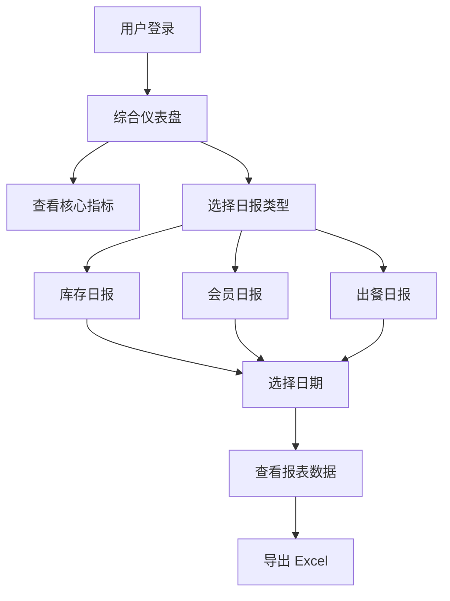

# 餐饮门店运营系统 - 日报功能 PRD

## 1. 产品概述
餐饮门店运营系统的库存、会员、出餐三大日报功能模块，帮助门店管理者每日掌握运营核心数据。
- 解决门店日报手工统计效率低、数据分散的问题，提供一站式可视化日报与综合仪表盘。
- 目标用户：门店店长、运营管理人员；价值：提升运营决策效率，降低库存损耗，精细化会员运营。

## 2. 核心功能

### 2.1 用户角色
| 角色 | 注册方式 | 核心权限 |
|------|----------|----------|
| 门店管理员 | 后台分配 | 查看全部日报、导出报表、管理基础数据 |
| 运营人员 | 后台分配 | 查看日报、导出报表 |

### 2.2 功能模块
1. **综合仪表盘**：核心指标卡片、营业趋势、库存预警、三大日报入口
2. **库存日报**：库存变动汇总、原料库存与预警、出入库明细
3. **会员日报**：新增/活跃会员、消费充值、积分、等级分布
4. **出餐日报**：出餐订单、营业额、菜品销量排行、高峰时段

### 2.3 页面详情
| 页面名称 | 模块名称 | 功能描述 |
|----------|----------|----------|
| 综合仪表盘 | 指标卡片 | 营业额、订单数、新增会员、库存预警数 |
| 综合仪表盘 | 营业趋势 | 近 7 天营业额/订单折线图 |
| 综合仪表盘 | 日报入口 | 快速跳转三大日报 |
| 库存日报 | 变动汇总 | 当日入库/出库总量统计 |
| 库存日报 | 库存预警 | 低于阈值的原料列表 |
| 库存日报 | 出入库明细 | 当日所有库存变动记录表格 |
| 会员日报 | 会员概览 | 新增、活跃、消费、充值指标 |
| 会员日报 | 等级分布 | 会员等级分布饼图 |
| 会员日报 | 交易明细 | 当日会员交易记录 |
| 出餐日报 | 出餐概览 | 订单数、营业额、客单价 |
| 出餐日报 | 销量排行 | 菜品销量 Top10 柱状图 |
| 出餐日报 | 时段分布 | 24 小时订单分布图 |

## 3. 核心流程
用户登录系统后进入综合仪表盘，查看当日核心运营指标。通过侧边栏导航进入各专项日报页面，选择日期查看对应日报，支持数据导出。

## 4. 用户界面设计

### 4.1 设计风格
- 主色：沉稳蓝绿 (#00857C) + 辅助橙 (#FA8C16) 用于预警
- 按钮风格：antd 圆角按钮，主操作实色填充
- 字体：系统默认 + 数字使用等宽字体强调
- 布局：顶部导航 + 左侧菜单 + 内容区卡片式布局
- 图标：antd 图标 + lucide-react

### 4.2 页面设计概览
| 页面名称 | 模块名称 | UI 元素 |
|----------|----------|---------|
| 综合仪表盘 | 指标卡片 | 四宫格统计卡，带图标与趋势 |
| 库存日报 | 库存预警 | 红色标签表格，预警高亮 |
| 会员日报 | 等级分布 | 彩色饼图 + 图例 |
| 出餐日报 | 销量排行 | 横向柱状图，Top10 |

### 4.3 响应式
桌面优先，适配平板；移动端隐藏侧边栏改用抽屉菜单。所有日报页支持日期选择器切换查询日期。
