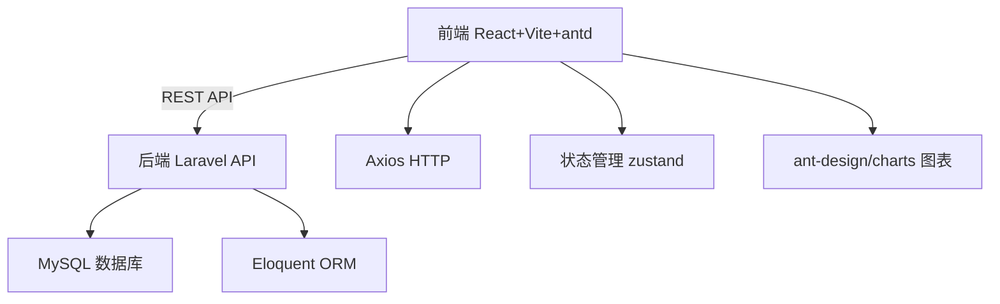
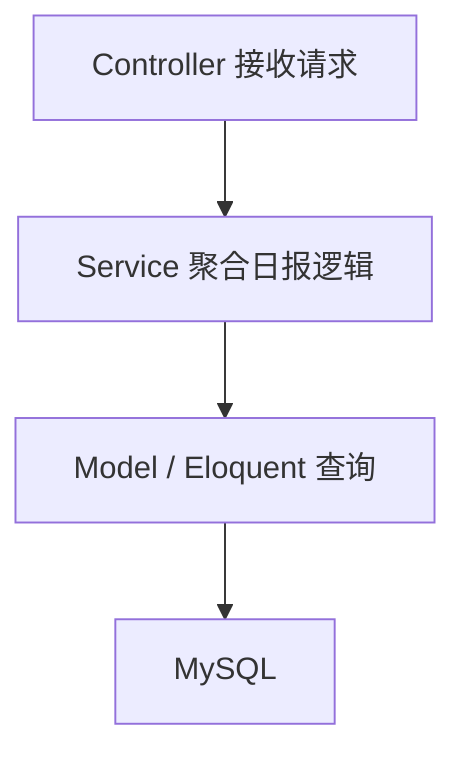
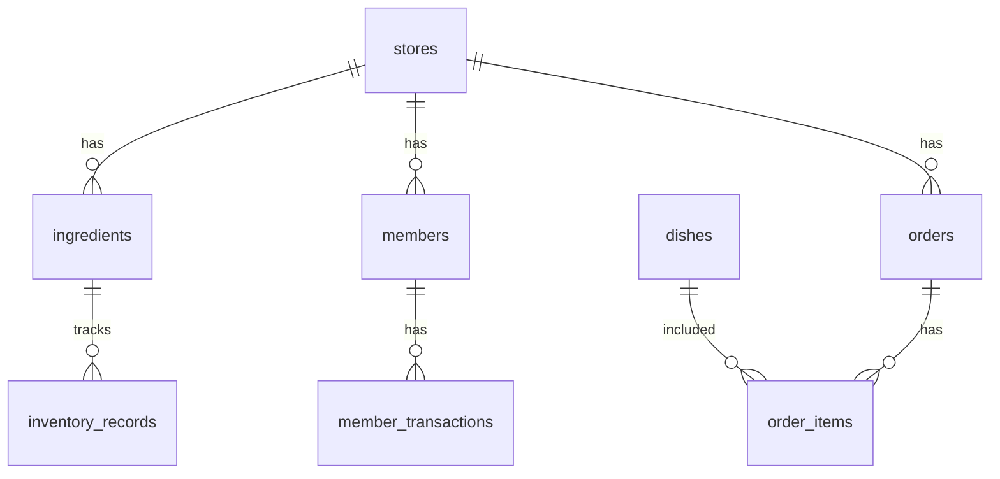

# 餐饮门店运营系统 - 日报功能技术架构

## 1. 架构设计


前后端分离：前端通过 Vite 开发服务器代理请求到 Laravel API；生产环境前端构建产物可由 Laravel 或 Nginx 托管。

## 2. 技术说明
- 前端：React@18 + TypeScript + Vite + Ant Design@5 + zustand + axios + dayjs + @ant-design/charts
- 初始化工具：vite-init（react-ts 模板）
- 后端：Laravel@10（PHP 8.1+）
- 数据库：MySQL 8.0

## 3. 路由定义（前端）
| 路由 | 用途 |
|------|------|
| / | 综合仪表盘 |
| /report/inventory | 库存日报 |
| /report/member | 会员日报 |
| /report/meal | 出餐日报 |

## 4. API 定义（后端）
| 方法 | 路径 | 用途 |
|------|------|------|
| GET | /api/dashboard?date=YYYY-MM-DD | 仪表盘综合指标 |
| GET | /api/reports/inventory?date=YYYY-MM-DD | 库存日报 |
| GET | /api/reports/member?date=YYYY-MM-DD | 会员日报 |
| GET | /api/reports/meal?date=YYYY-MM-DD | 出餐日报 |

响应示例（库存日报）：
```json
{
  "date": "2026-06-18",
  "summary": { "inbound": 120, "outbound": 85, "warning_count": 3 },
  "warning_list": [{ "id": 1, "name": "番茄", "stock": 5, "threshold": 10, "unit": "kg" }],
  "records": [{ "id": 1, "ingredient": "番茄", "type": "出库", "quantity": 2, "reason": "出餐消耗", "operator": "张三", "time": "2026-06-18 12:30" }]
}
```

## 5. 服务架构图


## 6. 数据模型

### 6.1 数据模型定义


### 6.2 数据定义语言（DDL 摘要）
- `stores` 门店：id, name, address, phone
- `ingredients` 原料：id, store_id, name, category, unit, stock_qty, warning_threshold
- `inventory_records` 库存记录：id, ingredient_id, type(入库/出库/盘点), quantity, reason, operator, created_at
- `members` 会员：id, store_id, name, phone, level, points, balance, total_spent, created_at
- `member_transactions` 会员交易：id, member_id, type(消费/充值/积分变动), amount, points_change, order_id, created_at
- `dishes` 菜品：id, store_id, name, category, price, cost, is_active
- `orders` 订单：id, store_id, order_no, member_id, total_amount, status, created_at
- `order_items` 订单明细：id, order_id, dish_id, quantity, price, subtotal

各表均含 `created_at` / `updated_at` 时间戳，日报按 `created_at` 日期过滤聚合。
